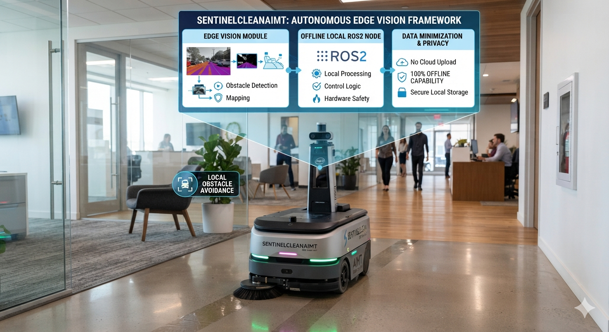

# SentinelCleanAIMT: Autonomous Edge Vision Framework for Intelligent Robotic Maintenance

**Course:** ITAI 1378 Computer Vision and AI (Houston City College)  
**Assignment:** Midterm Project Proposal (The Blueprint)  
**Team Member:** Cuong Dang (Individual Project)  
**Project Tier:** Tier 2 (Custom Fine-Tuning & Local Robotics Orchestration)

---

## 🎯 Project Overview
SentinelCleanAIMT represents the advanced midterm production blueprint branch of my core robotic maintenance platform, [Sentinel-Clean AI](https://github.com/binxixi23/sentinel-clean-ai). This system addresses the failure points of current market cleaning robots that operate blindly using raw proximity sensors. By utilizing high-performance edge vision, an offline local ROS2 node environment, and strict data minimization, this project ensures 100% offline capability, hardware safety, and user privacy.

---

## 🦅 Core Engineering Philosophies & Architectural Innovation

### A. The Executive Director Paradigm (Multi-Sensor Fusion & V2X Cooperative Telemetry)
Standalone RGB camera data fails under deep environmental shadows, blinding reflections, and total darkness (< 5 lux). To achieve true autonomy, SentinelCleanAIMT treats neural networks as just one executive component alongside a suite of specialized hardware assistants. 

Instead of forcing the robot to rely entirely on optical computer vision guessing, this framework integrates cooperative digital technical identification broadcasted directly from smart charging docks or environment beacons. This operational layer is built upon my [OmniID V2V/V2X Infrastructure](https://github.com/binxixi23/omniid-v2x-infrastructure) telemetry framework. By combining active Infrared (IR) Time-of-Flight micro-distance mapping with localized V2X packet metadata streams, the ROS2 node environment can instantly cross-reference YOLOv11 bounding boxes to validate edge-case anomalies before physical motor actuation occurs.

### B. Rigid Data-Centric AI Curation (Preventing the "Data-Y2K" Collapse)
In production-grade AI, a model is only as safe as the data it absorbs. Misaligned bounding boxes, ghost labels, and ground-shadow noise act as systemic technical debt. SentinelCleanAIMT bypasses automated bulk-labeling shortcuts. Instead, it enforces a strict **Data-Centric AI** pipeline centered on rigorous, manual annotation scrubbing across our open-source image banks to eliminate illumination artifacts, ensuring pristine ground-truth data integrity before training.

### C. Future Horizon Transition (NMS-Free & SAM 3 Adaptation)
The processing pipeline is designed to transition toward next-generation **NMS-Free (Non-Maximum Suppression)** end-to-end object detection architectures to eradicate post-processing latency overhead entirely. Furthermore, the segmentation engine maintains modular compliance to accept upcoming iterations like **SAM 3**, ensuring seamless drop-in upgrades as foundation models become increasingly optimized for microcontroller execution profiles.

---

## 🗂️ Completed Blueprint Slide Structure (8 Slides)

### Slide 1 – Title & Overview
- **Project Name:** SentinelCleanAIMT: Autonomous Edge Vision Framework for Intelligent Robotic Maintenance
- **Team Member Names:** Cuong Dang
- **Project Tier:** Tier 2 (Custom Fine-Tuning & Local Robotics Orchestration)

### Slide 2 – The Problem
- **Real-World Problem:** Current commercial cleaning robots operate blindly using raw proximity sensors. They cannot distinguish between dry debris (vacuumable) and liquid spills (which requires halting the vacuum to prevent destroying internal machinery filters).
- **Who Cares:** Smart home manufacturers, industrial janitorial automation companies, and logistics warehouse operators.
- **Why Important:** Traditional vacuuming over wet spills ruins multi-thousand-dollar floor-cleaning units and spreads stains across clean surfaces, causing structural maintenance property damage.

### Slide 3 – Your Solution
- **One-Sentence Description:** An intelligent, privacy-first floor maintenance system that uses vision-based edge computing and cooperative telemetry to detect and classify multi-state hazards.
- **Workflow Diagram:** `[Input Imagery (Camera)]` ➡️ `[Local RAM Preprocessing]` ➡️ `[YOLOv11 Edge Inference & V2X Fusion]` ➡️ `[ROS2 Behavior Tree Logic]` ➡️ `[Motor Control / Output Telemetry]`

### Slide 4 – Technical Approach
- **CV Technique:** Real-time Object Detection and Class-Agnostic Geometric Prompting.
- **Model Architecture:** CNN + Vision Transformer (ViT) Hybrid Core.
- **Model:** Ultralytics YOLOv11 (Label Specialist) paired with Meta SAM 2 (Zero-Shot Boundary Verification).
- **Framework:** PyTorch, Ultralytics SDK, and local ROS2 node structures integrated with [OmniID V2X Framework](https://github.com) stacks.
- **Why this approach:** YOLOv11 delivers high-inference frame rates directly within constrained local RAM to enforce data minimization, while SAM 2 provides perfect boundary maps for oddly-shaped liquid puddles without relying on heavy cloud APIs.

### Slide 5 – Data Plan
- **Source:** 100% Publicly available benchmark datasets sourced via Roboflow Universe and Kaggle Datasets (indoor debris and fluid marking repositories), integrated with digital V2X telemetry payloads.
- **Size:** Open-source image profiles expanded via targeted programmatic geometric and exposure data augmentations inside the PyTorch pipeline.
- **Labels:** `dry_debris`, `liquid_spill`, `charging_dock`, and `pet_obstacle`.

### Slide 6 – Success Metrics
- **Primary Metric:** We will measure Mean Average Precision ($\ge 0.45$ $\text{mAP}_{50-95}$) and Recall ($\ge 90\%$) for the `liquid_spill` class to guarantee the robot never accidentally runs over a fluid hazard.
- **Secondary Metric:** Real-time local inference execution latency $\le 45\text{ms}$ per image frame to guarantee physical collision avoidance safety margins.

### Slide 7 – Milestone Plan

| Phase / Target Week | Objective Goal | Project Deliverable Milestone |
| :--- | :--- | :--- |
| **Week 5 (Tonight)** | Project Scoping & Architecture Approval | Blueprint Submitted & Initial Repository Established |
| **Week 6** | End-to-End Pipeline Infrastructure Validation | Pre-trained Base Inferences Functional on 5 Test Frames |
| **Weeks 7 to 8** | Transfer Learning Integration & ROS2 Orchestration | Custom Weights Trained & Local Actuation Logic Unified |
| **Week 9** | Model Diagnostic Evaluation & System Optimization | Metric Matrix Recorded & Edge Failure Logs Cataloged |
| **Week 10** | Production-Grade Packaging & Final Review | System Repository Locked & Video Demonstration Compiled |

### Slide 8 – Risks and Resources
- **Top Risks & Plan B:** 
  1. *Dual-model inference overhead triggers latency bugs*: Lock the tracking pipeline to an optimal confidence threshold of 0.25 and run SAM 2 conditionally only when liquid-spill confidence keys trigger.
  2. *Hardware resource constraints trigger memory overflow*: Switch training and verification pipelines to Kaggle Notebook environments to leverage alternative free GPU allocations or downsample frame resolution scales.
- **Compute:** Free Google Colab GPU runtime instances for model fine-tuning; local machine architecture for system synthesis.
- **Estimated Cost:** $0.00 (Completely built using open-source packages and local edge compute paradigms).

---

## 🧠 AI Usage Log
See `docs/AI_usage_log.md`

---

## 🏁 Current Status
- [x] Repository created and renamed to `SentinelCleanAIMT`
- [ ] Proposal submitted
- [ ] First working demo
- [ ] System works on our data
- [ ] Metrics measured
- [ ] Final submitted
